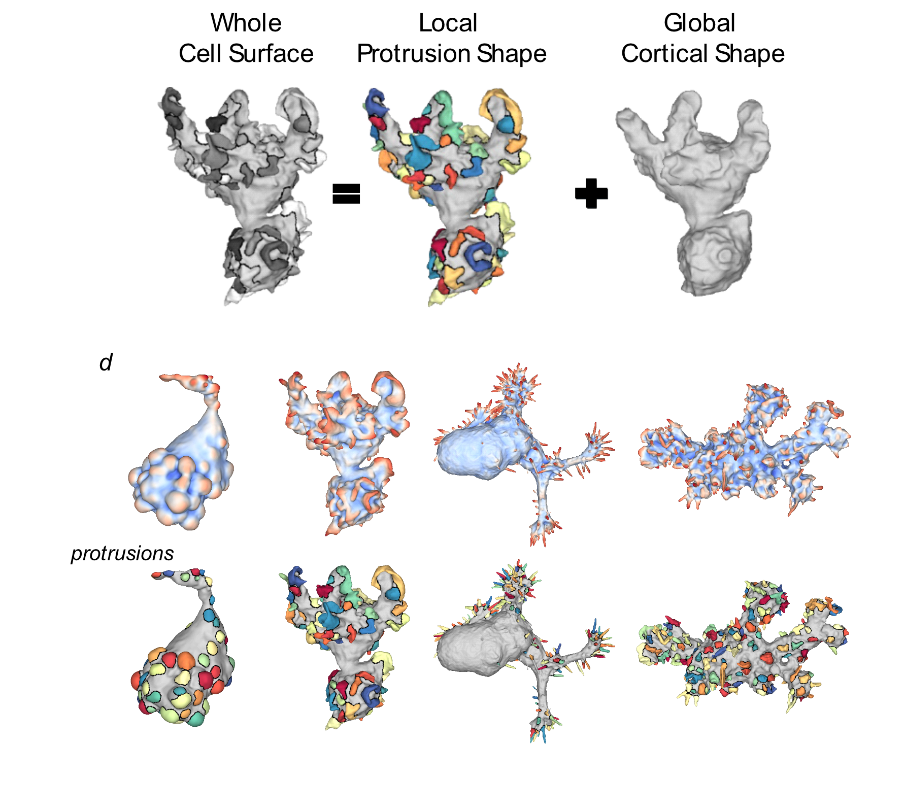

# u-Protrude3D
## Library for 3D Surface Motif Parsing and Basal Cortex Reconstruction
<p align="center">
  
</p>

**3D cell protrusion segmentation, benchmarking, and volumization for fluorescence microscopy derived meshes.**

`u-Protrude3D` takes a triangulated cell surface mesh and automatically detects, and labels individual protrusions (e.g. blebs, filopodia, microvilli, lamellipodia) by inferring an optimal basal reference surface. It can optionally benchmark predictions against ground-truth labels and volumize surface labels into 3-D voxel volumes. The latter effectively decomposes the cell volume = protrusion volumes + basal volume.    

An associated academic paper is forthcoming. 

[](https://badge.fury.io/py/u-Protrude3D)
[](https://pepy.tech/project/u-Protrude3D)
[](https://pepy.tech/project/u-Protrude3D)
[](https://pypistats.org/packages/u-Protrude3D)
[](https://github.com/DanuserLab/u-Protrude3D/)
[](https://github.com/DanuserLab/u-Protrude3D/)
[](https://github.com/DanuserLab/u-Protrude3D/blob/master/LICENSE)

- [Installation](#installation)
- [Quick-start](#quick-start)
- [Segment protrusions (scale-invariant, recommended)](#segment-protrusions-scale-invariant-recommended)
- [Segment protrusions (curvature-based, classic)](#segment-protrusions-curvature-based-classic)
- [Benchmark segmentation](#benchmark-segmentation)
- [Volumize protrusions](#volumize-protrusions)
- [Interactive GUI](#interactive-gui)
- [Parameter reference](#parameter-reference)
- [Tips and common adjustments](#tips-and-common-adjustments)
- [Questions and Issues](#questions-and-issues)
- [Danuser Lab Links](#danuser-lab-links)

---

## Installation

```bash
pip install u-Protrude3D
```

> **Solver note.** The default sparse solver is `pardiso` (Intel MKL). If you do not have MKL installed, change `cfg.cmcf.solver` to `'scipy'` (slower but dependency-free).

Pre-compile the numba JIT functions once before your first run to avoid a 10–30 s delay on the first call:

```python
import u_protrude3d
u_protrude3d.warmup()
```

---

## Quick-start

Use the script in `example_scripts` folder which performs the detection, benchmarking and voxelization decomposition on synthetic generated cell surface mesh to quickly get started. Further example real segmented cell meshes for testing are provided in the `example_data` folder. Note: only the synthetic cell surfaces have ground truth vertex labels and should be run with benchmarking script. Detection and voxelization does not require ground truth labels. 

**NOTE:** One of the example scripts specifically targets the segmentation of synthetic long, thin filopodia showing how to adapt the mean curvature flow to overcome deformation singularities that otherwise underestimates the filopodia height, causing missed detection of visually prominent filopodia

```python
import u_protrude3d as up3d

# 1. Segment protrusions using scale-invariant Shape Index (recommended)
result = up3d.segment_protrusions_invariant(
    mesh_path="data/cell01.obj",
    save_dir="output/cell01/",
)
print(result.vertex_labels)   # integer label per vertex (0 = background)

# 2. Benchmark predicted labels against ground truth
bench = up3d.benchmark_segmentation(
    pred_dirs=["output/cell01/", "output/cell02/"],
    gt_dirs=["gt/cell01/",       "gt/cell02/"],
    save_dir="output/benchmark/",
)
print(bench.ap)  # shape (n_cells, n_thresholds)

# 3. Volumize: map surface labels into a 3-D voxel array
vol = up3d.volumize_protrusions(
    mesh_path="data/cell01.obj",
    protrusion_labels=result.vertex_labels,
    tif_path="data/cell01.tif",
    save_dir="output/cell01_vol/",
)
print(vol.volume_labels.shape)  # (Z, Y, X)
```

---

## Segment protrusions (scale-invariant, recommended)

`segment_protrusions_invariant` is the recommended segmentation path. It detects protrusions using the **Koenderink Shape Index (SI)** — a dimensionless curvature character measure that ranges from −1 (concavity/cup) through 0 (cylindrical ridge) to +1 (spherical dome). Because SI is normalised by cell surface area it works without retuning across different cell sizes, voxel sizes, or microscope resolutions.

### Pipeline overview

1. Load and optionally remesh the surface.
2. Compute per-vertex principal curvatures → Shape Index, ridgeness, height field via cMCF inflation.
3. Smooth all scalar fields; compute eight scale-invariant descriptors; export coloured `.obj` files for visual inspection.
4. Binarise the height field → initial connected-component (CC) patches.
5. **Per-patch SI labelling** — for each patch, Otsu-threshold face-level SI to find dome-like (high-SI) regions; propagate those seed labels to all patch faces by geometric-affinity diffusion. Patches with no high-SI region receive a single label.
6. **Adaptive saddle merge** *(optional, recommended)* — merge adjacent label pairs that are spurious over-splits, using a criterion that depends on the shape type of each label (compact bleb vs. elongated ridge).
7. Apply basal mask; remove small isolated fragments; save outputs.

### Full example

```python
import u_protrude3d as up3d

cfg = up3d.SegmentConfig()

# Core geometry parameters
cfg.voxel_size    = 0.160   # physical voxel size (µm)
cfg.cmcf.n_iters  = 20      # cMCF inflation steps — more → smoother basal reference

# ── Initial height binarization (critical — tune this first) ──────────────────
# This step determines which surface regions are candidates for protrusions.
# The threshold method and prop_iters are strongly coupled — see parameter table.
#
# Option A: mean threshold (default, inclusive, good starting point)
cfg.initial_height.use_mean             = True
cfg.initial_height.use_otsu             = False
cfg.initial_height.prop_iters           = 1     # 1 diffusion step is usually enough

# Option B: conservative 3-level Otsu (only protrusion tips initially; needs more diffusion)
# cfg.initial_height.use_mean           = False
# cfg.initial_height.use_otsu           = True
# cfg.initial_height.otsu_n_levels      = 3     # three height classes: low / mid / high
# cfg.initial_height.otsu_level         = -1    # use the highest threshold (tips only)
# cfg.initial_height.prop_iters         = 5     # more diffusion to recover full protrusion extent
# cfg.initial_height.prop_rebinarize    = 0.25  # keep vertices with propagated prob > this
# ─────────────────────────────────────────────────────────────────────────────

# Per-patch SI labelling
cfg.invariant.si_segment_method        = 'multiotsu'   # how to threshold SI within each patch
cfg.invariant.si_segment_otsu_n_levels = 2             # number of Otsu classes
cfg.invariant.n_diffusion_iters        = 5             # label-spreading iterations

# Adaptive saddle merge (on by default)
cfg.invariant.ws_saddle_merge          = True
cfg.invariant.ws_saddle_criterion      = 'adaptive'    # recommended: bleb vs. ridge-aware
cfg.invariant.ws_saddle_ar_threshold   = 0.5    # mean SI > this → compact/bleb; ≤ → elongated/ridge
cfg.invariant.ws_saddle_si_threshold   = 0.5    # compact pairs: merge if mean(SI at boundary) > this
cfg.invariant.ws_saddle_depth_threshold = 0.2   # elongated pairs: merge if valley depth < this

result = up3d.segment_protrusions_invariant(
    mesh_path="data/cell01.obj",
    save_dir="output/cell01/",
    cfg=cfg,
)

# Result fields
result.vertex_labels      # (N,) int  — per-vertex instance labels (0 = background)
result.vertex_labels_cc   # (N,) int  — initial CC labels before per-patch SI splitting
result.basal_binary       # (N,) bool — protrusion-permissive binary mask
result.height             # (N,) float — smoothed cMCF displacement height
result.shape_index        # (N,) float — Koenderink SI ∈ [−1, +1]
result.curvedness_norm    # (N,) float — sqrt((k1²+k2²)/2) · sqrt(A)
result.ridgeness_norm     # (N,) float — ridgeness · sqrt(A)
result.H_mean_norm        # (N,) float — H_mean · sqrt(A)  (signed)
result.K_norm             # (N,) float — k1·k2 · A          (signed)
result.curv_anisotropy    # (N,) float — (|k_max|−|k_min|)/(|k_max|+|k_min|) ∈ [0, 1]
result.principal_ratio    # (N,) float — |k_min|/|k_max| ∈ [0, 1]
result.total_surface_area # float — total mesh area in mesh-unit²
result.output_paths       # dict of Path objects for every saved file
```

### Output files

| File | Contents |
|---|---|
| `raw_surface_stats.mat` | Pre-smoothing curvatures, height field, and raw scale-invariant metrics |
| `smooth_surface_stats.mat` | Smoothed curvatures, height field, and smoothed scale-invariant metrics |
| `initial_patch_areas.svg` | Bar chart of initial CC areas with large-patch threshold line |
| `external_MCF_iteration_determination.svg` | cMCF Gaussian curvature trace with selected reference iteration marked |
| `instance_protrusion_segmentation_stats.mat` | Final instance labels, initial CC labels, height field, curvatures, basal binary |
| `inv_shape_index.obj`, `inv_curvedness_norm.obj`, … | Per-measure coloured mesh exports (coolwarm colormap) |
| `inv_height_binary.obj`, `inv_basal_binary.obj` | Binary mesh exports (red = foreground, gray = background) |
| `inv_final_labels.obj` | Final per-instance coloured mesh |

### Adaptive saddle merge — how it works

After per-patch SI labelling, adjacent label pairs within each patch are evaluated. Each label is first classified by its **mean Shape Index**:

- **Compact** (mean SI > `ws_saddle_ar_threshold`) — bleb-like dome.
- **Elongated** (mean SI ≤ threshold) — ridge/lamellipodia-like.

The merge criterion then depends on the pair's types:

| Pair type | Criterion | Merge if… |
|---|---|---|
| Both compact | SI boundary | mean(SI at shared boundary) > `ws_saddle_si_threshold` |
| Both elongated | Height depth | (h_lower − h_saddle) / h_lower < `ws_saddle_depth_threshold` |
| Mixed (bleb + ridge) | — | Never merged — genuine bleb–ridge junction |

This prevents merging blebs with filopodia (which would produce physically nonsensical labels) while correctly collapsing over-segmented dome fragments and shallow ridge splits.

### Chaining into volumize

```python
result = up3d.segment_protrusions_invariant(
    "data/cell01.obj", "output/cell01/", cfg=cfg
)

vol = up3d.volumize_protrusions(
    mesh_path="data/cell01.obj",
    protrusion_labels=result.vertex_labels,
    tif_path="data/cell01.tif",
    save_dir="output/cell01_vol/",
)
```

---

## Segment protrusions (curvature-based, classic)

`segment_protrusions` is the original pipeline. It classifies each candidate patch as bleb-like or ridge-like using a ratiometric curvature threshold and applies separate segmentation strategies for each type.

### Full example

```python
import u_protrude3d as up3d

cfg = up3d.SegmentConfig()

cfg.voxel_size   = 0.160   # physical voxel size of the microscope (µm)
cfg.cmcf.n_iters = 25      # more iterations → smoother basal reference

# ── Initial height binarization (critical — tune this first) ──────────────────
cfg.initial_height.use_mean          = True   # threshold at mean height (default, inclusive)
cfg.initial_height.prop_iters        = 1      # diffusion steps to grow binary outward
cfg.initial_height.prop_rebinarize   = 0.25   # keep vertices with propagated prob > this

# For a more conservative threshold (protrusion tips only), use 3-level Otsu + more diffusion:
# cfg.initial_height.use_mean        = False
# cfg.initial_height.use_otsu        = True
# cfg.initial_height.otsu_n_levels   = 3
# cfg.initial_height.otsu_level      = -1    # highest threshold class
# cfg.initial_height.prop_iters      = 5
# ─────────────────────────────────────────────────────────────────────────────

cfg.std_patch.curv_ridge_ratio_threshold = 0.35   # more aggressive filopodium detection

result = up3d.segment_protrusions(
    mesh_path="data/cell01.obj",
    save_dir="output/cell01/",
    cfg=cfg,
    tif_path="data/cell01.tif",       # optional: needed for SDF-based binary
    gt_label_path="gt/cell01.tif",    # optional: compute inline AP score
)

# Result fields
result.vertex_labels   # (N,) int — 0 = background, 1..K = protrusion instances
result.cMCF_steps      # (N, 3, T) float — mesh vertex positions at each cMCF step
result.basal_binary    # (N,) bool — vertices classified as basal (non-protrusion)
result.dists           # (N,) float — signed-distance height field
result.H               # (N,) float — mean curvature at each vertex
result.output_paths    # dict of Path objects for every saved file
result.ap              # AP scores (only if gt_label_path was provided)
```

### Chaining into volumize

```python
result = up3d.segment_protrusions("data/cell01.obj", "output/cell01/", cfg=cfg)

vol = up3d.volumize_protrusions(
    mesh_path="data/cell01.obj",
    protrusion_labels=result.vertex_labels,
    tif_path="data/cell01.tif",
    save_dir="output/cell01_vol/",
    cMCF_steps=result.cMCF_steps,
)
```

---

## Benchmark segmentation

### Full example

```python
import glob
import u_protrude3d as up3d

pred_dirs = sorted(glob.glob("output/cell*/"))
gt_dirs   = sorted(glob.glob("gt/cell*/"))

cfg = up3d.BenchmarkConfig()
cfg.figure_format = "png"   # change output format
cfg.figure_dpi    = 300

bench = up3d.benchmark_segmentation(
    pred_dirs=pred_dirs,
    gt_dirs=gt_dirs,
    save_dir="output/benchmark/",
    cfg=cfg,
)

# Result fields
bench.ap               # (n_cells, n_thresholds) average precision
bench.tp               # (n_cells, n_thresholds) true positives
bench.fp               # (n_cells, n_thresholds) false positives
bench.fn               # (n_cells, n_thresholds) false negatives
bench.iou_thresholds   # (n_thresholds,) the IoU cutoffs used
bench.per_cell_names   # list of folder names, one per cell
bench.figures          # dict of matplotlib Figure objects
bench.output_paths     # dict of saved file paths
```

The `.mat` files inside each `pred_dir` must contain the key `protrusion_labels` (per-vertex integer array). Ground-truth `.mat` files must contain the key `protrude_labels`.

**When pred and GT labels live on different meshes** (e.g. the prediction was computed on a remeshed surface), supply the mesh filenames so the GT labels can be transferred onto the prediction mesh before comparison:

```python
bench = up3d.benchmark_segmentation(
    pred_dirs=pred_dirs,
    gt_dirs=gt_dirs,
    pred_mesh_filename="mesh.obj",     # mesh inside each pred_dir
    gt_mesh_filename="gt_mesh.obj",    # mesh inside each gt_dir
    save_dir="output/benchmark/",
    cfg=cfg,
)
```

If `pred_mesh_filename` and `gt_mesh_filename` are the same, only one argument is needed. The transfer uses barycentric interpolation (`meshtools.transfer_mesh_measurements`) and runs automatically only when the vertex counts differ.

---

## Volumize protrusions

### Full example

```python
import numpy as np
import u_protrude3d as up3d

cfg = up3d.VolumeConfig()
cfg.voxel_size          = 0.160   # must match the acquisition voxel size (µm)
cfg.total_shrinkwrap_iters = 120  # more iterations → tighter basal fit
cfg.gvf_iters           = 20      # more GVF smoothing → cleaner force field

vol = up3d.volumize_protrusions(
    mesh_path="data/cell01.obj",
    protrusion_labels=np.load("labels.npy"),   # (N_vertices,) int
    tif_path="data/cell01.tif",
    save_dir="output/cell01_vol/",
    cfg=cfg,
)

# Result fields
vol.volume_labels   # (Z, Y, X) int16 — voxel-space protrusion labels
vol.cell_binary     # (Z, Y, X) bool  — voxel cell mask
vol.basal_binary    # (Z, Y, X) bool  — voxel basal region mask
vol.surface_labels  # (N,) int        — final per-vertex labels after refinement
vol.output_paths    # dict of saved file paths
```

---

## Interactive GUI

Open a point-and-click parameter editor that returns the updated config objects:

```python
import u_protrude3d as up3d

# Launch with defaults
seg_cfg, bench_cfg, vol_cfg = up3d.launch_config_gui()

# Or pre-populate from existing configs
seg_cfg, bench_cfg, vol_cfg = up3d.launch_config_gui(
    cfg_segment=seg_cfg,
    cfg_benchmark=bench_cfg,
    cfg_volume=vol_cfg,
)

# Use the edited configs immediately
result = up3d.segment_protrusions("data/cell01.obj", "output/", cfg=seg_cfg)
```

The GUI window has three tabs (Segment / Benchmark / Volume). Click **Apply** to validate and commit values, **Export JSON** to save a config file, and **Load JSON** to restore one.

---

## Parameter reference

### SegmentConfig — general pipeline settings

| Parameter | Default | Explanation |
|---|---|---|
| `voxel_size` | `0.160` | Physical size of one voxel in micrometers. Must match your microscope acquisition settings. Used when converting the mesh into a signed-distance height field. |
| `n_smooth_scalar_fn_iters` | `50` | How many Laplacian smoothing passes are applied to the height-field scalar before thresholding. More passes reduce noise but may blur sharp protrusion boundaries. |
| `offset_ref_ind` | `0` | Which cMCF iteration is used as the "reference" flat baseline for height calculation. Increase if the very first inflation step produces a noisy reference. |
| `min_size_comps_initial` | `20` | Minimum number of vertices a connected region must have to survive the initial foreground detection. Smaller values keep more detail; larger values discard more noise. |
| `min_size_comps_protrude_patch` | `5` | Same size filter applied to sub-patches inside each candidate protrusion region. |
| `sdf_binary_dilate_ksize` | `2` | Dilation radius (in voxels) applied to the binary cell mask before computing the height field. Increase if protrusion bases are getting clipped. |
| `sdf_binary_erode_ksize` | `1` | Erosion radius after dilation. Balances out the dilation to avoid inflating the mask. |
| `curvature_radius` | `5` | Neighbourhood radius (in mesh hops) used when computing principal curvatures. Larger values smooth the curvature estimate and are better for coarse meshes; smaller values preserve local detail. |
| `n_protrude_colors` | `24` | Size of the colour palette used when saving coloured `.obj` visualisation files. Increase if you have more than 24 protrusions per cell. |
| `random_seed` | `1232` | Seeds the random-colour palette so colours are reproducible across runs. |
| `debug_viz` | `False` | When `True`, saves extra intermediate visualisations. Useful for diagnosing segmentation failures but produces many files. |

---

### cMCFConfig — basal-surface extraction

The pipeline "inflates" the mesh inward using conformal Mean Curvature Flow (cMCF) to find the smooth, protrusion-free basal surface. The height of each vertex above this inflated reference is the main signal used for protrusion detection.

| Parameter | Default | Explanation |
|---|---|---|
| `n_iters` | `20` | Number of inflation steps. More iterations → a smoother, more convex basal reference. Increase for highly irregular or spiky cells; decrease if the reference over-smooths and loses anatomically relevant curvature. |
| `step_size` | `0.25` | How far the mesh moves per inflation step (as a fraction of the Laplacian update). Larger values converge faster but can cause mesh tangling. |
| `extra_smooth` | `False` | Apply a small amount of Laplacian mesh smoothing between each cMCF step. Helps stabilise convergence on meshes with very irregular triangles. |
| `deltaL_smooth` | `5e-5` | Strength of the inter-step Laplacian smoothing (only used when `extra_smooth=True`). Very small by default to avoid distorting the mesh. |
| `deltaL` | `5e-4` | Laplacian step size multiplier for the cMCF update itself. Rarely needs changing; reduce if you see mesh instability. |
| `mollify_factor` | `1e-5` | Regularisation constant for the robust Laplacian, which guards against numerical errors in near-degenerate triangles. Only needs increasing if you see linear-algebra warnings. |
| `solver` | `'pardiso'` | Sparse linear solver used at each cMCF step. `'pardiso'` (Intel MKL) is fastest. Use `'scipy'` if MKL is not available. |

---

### InitialHeightConfig — protrusion binary mask

> **This is one of the most critical settings in the pipeline.** The initial height binarization defines which surface regions are treated as protrusions for both the classical (`segment_protrusions`) and invariant (`segment_protrusions_invariant`) pipelines. An overly tight threshold will miss real protrusions; an overly loose one will bleed into the cell body. Getting this right — and pairing the threshold with an appropriate `prop_iters` — has a large effect on downstream segmentation quality.

After computing the height field, these settings control how it is binarised into "protrusion" vs. "background".

| Parameter | Default | Explanation |
|---|---|---|
| `use_auto` | `True` | Automatically select a threshold from the height-field distribution. Set to `False` to use `manual_threshold` instead. |
| `use_mean` | `True` | When `use_auto=True`, threshold at the mean height value. Simple and robust for most cells. |
| `use_otsu` | `False` | When `use_auto=True`, use multi-class Otsu's method instead of the mean. More adaptive but can be fooled by bimodal distributions. Only one of `use_mean` / `use_otsu` should be `True`. |
| `otsu_n_levels` | `3` | Number of classes for multi-class Otsu when `use_otsu=True`. `3` levels gives low / mid / high height classes; the selected class is controlled by `otsu_level`. |
| `otsu_level` | `-1` | Which Otsu class to use as the protrusion threshold. `-1` = the highest threshold (most conservative — only the tallest protrusions); `0` = the lowest threshold (most inclusive). Use `-1` with 3-level Otsu for conservative binarization, `0` for inclusive. |
| `manual_threshold` | `3.0` | Height value (in µm) used as the threshold when `use_auto=False`. Increase to be more conservative (fewer, larger protrusions detected). |
| `prop_iters` | `1` | How many label-diffusion steps are applied to the binary mask after thresholding. More iterations grow the binary region outward, filling in gaps and extending protrusion boundaries further down the flanks. **This should be tuned alongside the threshold method** — see guidance below. |
| `prop_rebinarize` | `0.25` | After diffusion, vertices whose propagated probability exceeds this value are kept as foreground. Lower = more inclusive boundary. |

#### Threshold method and `prop_iters` — recommended pairings

The threshold method and `prop_iters` are strongly coupled. A high threshold produces a tight binary that sits near protrusion tips only; diffusion is needed to grow it back down to the flanks. A low threshold already includes the flanks and needs little or no diffusion.

| Threshold setting | Typical behaviour | Recommended `prop_iters` |
|---|---|---|
| `use_mean=True` | Moderate threshold; includes most of each protrusion | `1` (default) |
| `use_otsu=True`, `otsu_n_levels=2`, `otsu_level=-1` | Similar to mean; two-class split | `1` |
| `use_otsu=True`, `otsu_n_levels=3`, `otsu_level=-1` | High threshold — only protrusion tips initially labelled | `5` — more diffusion needed to recover the full protrusion extent |
| `use_otsu=True`, `otsu_n_levels=3`, `otsu_level=0` | Low threshold — inclusive, similar to mean | `1` |
| `use_auto=False`, high `manual_threshold` | Very conservative | `3–5` depending on threshold |

In general: **the higher (more conservative) the threshold, the more `prop_iters` are needed** to grow the binary back out to a biologically meaningful extent. Too few iterations with a high threshold will under-label protrusions; too many with a low threshold will bleed the mask into the cell body.

---

### InvariantConfig — SI-based segmentation and saddle merge

These parameters control `segment_protrusions_invariant`. They live under `cfg.invariant`.

#### Per-patch Shape Index labelling

| Parameter | Default | Explanation |
|---|---|---|
| `si_segment_method` | `'multiotsu'` | How to binarise Shape Index within each patch to find dome-like (high-SI) seed regions. `'multiotsu'` uses Otsu's multi-class method; `'mean'` thresholds at the patch mean. |
| `si_segment_otsu_n_levels` | `2` | Number of Otsu classes when `si_segment_method='multiotsu'`. `2` = one threshold (foreground/background); `3` = two thresholds. |
| `si_segment_otsu_level` | `-1` | Which Otsu threshold to use, with Python negative indexing: `-1` = highest (most selective — fewer seeds). Raise to `-2` to be more inclusive. |
| `n_diffusion_iters` | `5` | How many geometric-affinity label-spreading steps propagate the seed labels to the rest of the patch. More iterations fill larger patches but can blur boundaries between adjacent instances. |

#### Watershed seeding (alternative to SI threshold)

These parameters are only relevant when `watershed_seeding` is set to `'height'` or `'shape_index'`. The default (`None`) uses the SI binarisation path above.

| Parameter | Default | Explanation |
|---|---|---|
| `watershed_seeding` | `None` | Seeding strategy. `None` = SI threshold + label diffusion (recommended). `'height'` = seed geodesic watershed from local height maxima. `'shape_index'` = seed from local SI maxima. |
| `ws_min_peak_dist` | `3` | Minimum graph-hop distance between kept peaks during non-maximum suppression. Prevents two seeds from being placed on the same dome summit. |
| `ws_smooth_iters` | `10` | Smoothing passes applied to the seed scalar field before peak finding. `0` = skip. |
| `ws_peak_eps` | `0.0` | Plateau tolerance for peak finding. `0` = strict local maximum; `>0` allows plateau vertices to qualify as peaks (useful for flat SI domes). |

#### Adaptive saddle merge

| Parameter | Default | Explanation |
|---|---|---|
| `ws_saddle_merge` | `True` | Enable the saddle merge step. Applies to all seeding paths. Set to `False` to keep the raw per-patch labels without merging. |
| `ws_saddle_criterion` | `'height'` | Which criterion governs merging. `'adaptive'` (recommended): classify each label as compact or elongated by its mean SI, then apply the appropriate criterion. `'height'`: use the valley-depth criterion for all pairs. `'shape_index'`: use the SI boundary criterion for all pairs. |
| `ws_saddle_ar_threshold` | `0.5` | **Adaptive criterion only.** Labels whose mean Shape Index exceeds this value are classified as compact (bleb-like, use the SI boundary criterion); labels at or below it are classified as elongated (ridge-like, use the height-depth criterion). Adjust if blebs and ridges in your data are not well separated at 0.5. |
| `ws_saddle_si_threshold` | `0.5` | **Compact–compact pairs.** Two compact labels are merged when the mean SI of their shared boundary vertices exceeds this value. A high-SI boundary means the contact region is itself dome-like — the two labels are the same protrusion. Lower to merge more aggressively; raise to be more conservative. |
| `ws_saddle_depth_threshold` | `0.2` | **Elongated–elongated pairs.** Two elongated labels are merged when `(h_lower − h_saddle) / h_lower < threshold`, where `h_saddle` is the mean height on the shared boundary and `h_lower` is the mean height of the shallower label. A small value means the boundary sits almost as high as the protrusion tip — a shallow ridge with no real valley between segments. Raise to merge more aggressively. |

---

### LargePatchConfig — oversized patch handling

Patches larger than `min_max_area` faces are treated differently because they often represent lamellipodia or other flat, broad structures rather than discrete protrusions.

| Parameter | Default | Explanation |
|---|---|---|
| `min_max_area` | `10000` | Face count above which a candidate patch is classified as "large". Increase if you want the algorithm to treat more patches as discrete protrusions rather than large flat structures. |
| `max_area_thresh_factor` | `0.0` | Adds `factor × median_patch_area` to `min_max_area` as an adaptive component. Useful when patch sizes vary widely across cells. |
| `curv_ridge_ratio_threshold` | `0.5` | Fraction `ridgeness / (ridgeness + |curvature|)` for the patch, in [0, 1]. Below this fraction the patch is classified as bleb-like (dome, segmented by curvature); above it, ridge-like (filopodium/lamellipodium edge, segmented by ridgeness). Because curvature and ridgeness share units, this ratio is dimensionless and doesn't need retuning across voxel sizes, unlike a raw ridgeness threshold. |
| `occ_threshold` | `0.4` | If the fraction of the patch that is "occupied" by the primary binary mask exceeds this value, a simpler single-step segmentation is used; otherwise a two-step approach is applied. |
| `H_segment_method` | `'mean'` | How to threshold mean curvature within a bleb-like large patch. `'mean'` = threshold at the mean value; `'multiotsu'` = use Otsu multi-class thresholding for a more data-driven cut. |
| `H_segment_otsu_n_levels` | `3` | Number of Otsu classes when `H_segment_method='multiotsu'`. More classes = finer curvature bins. |
| `H_segment_otsu_level` | `-1` | Which Otsu threshold to use, with Python negative indexing: `-1` = highest (most conservative), `-2` = second-highest (more inclusive). |
| `second_seg_H_method` | `'multiotsu'` | Method for the second-pass H segmentation (applied to complex patches that the first pass could not cleanly resolve). |
| `second_seg_H_otsu_n_levels` | `2` | Otsu levels for the second-pass segmentation. |
| `second_seg_H_otsu_level` | `-1` | Which Otsu threshold for the second pass. |
| `ridge_segment_method` | `'mean'` | How to threshold ridgeness within a ridge-like large patch. |
| `ridge_otsu_n_levels` | `3` | Otsu levels for ridge segmentation. |
| `ridge_otsu_level` | `-1` | Which Otsu threshold for ridge segmentation. |

---

### StdPatchConfig — standard patch classification

Standard-sized patches (below `LargePatchConfig.min_max_area`) go through a more detailed classification pipeline that separates blebs (dome-shaped), filopodia (thin ridges), and lamellipodia (flat sheets).

#### Protrusion-type thresholds

| Parameter | Default | Explanation |
|---|---|---|
| `curv_ridge_ratio_threshold` | `0.5` | Fraction `ridgeness / (ridgeness + |curvature|)` for the patch, in [0, 1]. Below this fraction the patch is classified as bleb-like (curvature-dominated, feeds the multi-bleb check); above it, ridge-like (ridgeness-dominated, segmented by ridgeness). Being a dimensionless ratio of two curvature quantities, it doesn't need retuning across voxel sizes. |

#### Mean-curvature (H) segmentation

These parameters control how the height within each patch is binarised using mean curvature.

| Parameter | Default | Explanation |
|---|---|---|
| `H_segment_method` | `'multiotsu'` | `'mean'`: threshold at the patch mean — fast but less adaptive. `'multiotsu'`: data-driven threshold using Otsu classes — better when curvature is bimodal. |
| `H_segment_otsu_n_levels` | `2` | Number of Otsu classes. `2` = one threshold (foreground/background). `3` = two thresholds (add an intermediate class). |
| `H_segment_otsu_level` | `-1` | Which threshold to use. `-1` = highest (most conservative, fewest foreground vertices). |
| `H_segment_erode_steps` | `2` | Number of morphological erosion passes applied to the H binary on the mesh. Erosion shrinks the foreground, removing thin connections and isolated specks. |
| `H_segment_use_local_adaptive` | `True` | Compute the H threshold locally (per-patch adaptive baseline) rather than globally. Recommended: handles illumination or curvature gradients across the cell surface. |
| `H_local_adaptive_smooth_iters` | `50` | Number of Laplacian smoothing steps used to estimate the local H baseline. More iterations → a smoother, more global baseline. |
| `apply_power_H_correct` | `True` | Apply a power-law correction (`H^power_H_correct`) before thresholding. This compresses the high end of the curvature range, which can make thresholding more robust when a few vertices have extreme values. |
| `power_H_correct` | `0.5` | Exponent for the power correction (default `0.5` = square-root). Values < 1 compress the high end; values > 1 amplify it. |

#### Ridgeness segmentation

The same structure as H segmentation but applied to the ridgeness scalar field, which is high along the crests of narrow protrusions.

| Parameter | Default | Explanation |
|---|---|---|
| `ridge_segment_method` | `'multiotsu'` | Threshold method for ridgeness. Same options as `H_segment_method`. |
| `ridge_otsu_n_levels` | `3` | Otsu classes for ridgeness. |
| `ridge_otsu_level` | `-1` | Which Otsu threshold to use. |
| `ridge_segment_erode_steps` | `1` | Erosion passes on the ridge binary. |
| `ridge_use_local_adaptive` | `True` | Use a per-patch adaptive ridgeness baseline. |
| `ridge_local_adaptive_smooth_iters` | `50` | Smoothing iterations for the local ridge baseline. |
| `apply_power_ridge_correct` | `False` | Apply power correction to ridgeness before thresholding. Disabled by default because ridgeness is already well-scaled. |
| `power_ridge_correct` | `0.5` | Exponent if power correction is enabled. |

#### Planarity test (filopodium detection)

| Parameter | Default | Explanation |
|---|---|---|
| `planarity_check_frac` | `1.0` | Maximum fraction of interior vertices allowed to lie *outside* the projected boundary hull for the patch to be considered planar (filopodium-like). `1.0` = any planarity passes; lower values enforce stricter planarity. |
| `planarity_check_dilate_binary` | `2` | Dilation radius (pixels) used when rasterising the boundary for the planarity test. Increase for coarser meshes where boundaries look jagged in projection. |

#### Multi-bleb splitting

If a single large foreground region contains multiple dome-shaped sub-structures, these parameters control whether it is split into separate bleb labels.

| Parameter | Default | Explanation |
|---|---|---|
| `multibleb_min_recovered_frac` | `0.4` | Watershed must recover at least this fraction of the region area for splitting to proceed. Prevents over-splitting of noisy, heterogeneous patches. |
| `multibleb_min_occ_area_fraction` | `0.1` | Each candidate sub-bleb must occupy at least this fraction of the total patch area. Eliminates very small fragments. |
| `multibleb_max_mean_aspect_ratio` | `2.0` | Sub-blebs whose average aspect ratio exceeds this value are rejected (too elongated to be a bleb — likely a filopodium). |
| `multibleb_check_neck_neg_curvature` | `False` | Additionally require negative curvature at the boundary between sub-blebs (a "neck"). Stricter splitting criterion; rarely needed. |
| `multibleb_neck_neg_curvature_thresh` | `-0.05` | Curvature value that counts as a neck when `multibleb_check_neck_neg_curvature=True`. More negative = stricter. |

---

### BenchmarkConfig

| Parameter | Default | Explanation |
|---|---|---|
| `iou_thresholds` | `linspace(0, 1, 21)` | List of IoU cutoffs at which AP/TP/FP/FN are evaluated. The default gives a sweep from 0 to 1 in steps of 0.05. Narrow to `[0.5, 0.75]` for a COCO-style summary. |
| `save_figures` | `True` | Save mean-AP and median-AP curve figures alongside the summary `.mat` file. |
| `figure_dpi` | `600` | Resolution of saved figures in dots-per-inch. Use `300` for drafts, `600` for publication. |
| `figure_format` | `'svg'` | Output format: `'svg'` (lossless, scalable), `'pdf'`, or `'png'`. |

---

### VolumeConfig — volumization

| Parameter | Default | Explanation |
|---|---|---|
| `voxel_size` | `0.160` | Physical voxel size (µm). Must match `SegmentConfig.voxel_size` and your acquisition settings. |
| `gvf_mu` | `0.01` | Diffusion coefficient for the Gradient Vector Field (GVF). GVF is a smoothed version of the signed-distance gradient used to guide the inward mesh advection. Larger `mu` → more diffusion, which helps the force field reach into deep concavities but blurs boundaries. |
| `gvf_iters` | `15` | Number of GVF diffusion iterations. More iterations → a smoother force field that extends further from the original gradient. Only active when `use_mesh_based_shrinkwrap=False` (non-default). |
| `total_shrinkwrap_iters` | `100` | Total number of steps the basal surface mesh takes as it shrinks inward to fit the cell body. More iterations → tighter basal fit, but also more computation time. |
| `use_mesh_based_shrinkwrap` | `False` | **Work in progress — keep at `False`.** Use mesh-based shrinkwrap instead of GVF. Uses direct BVH closest-point queries at every step and constrained Laplacian force diffusion — no voxelization required. Although faster for large meshes, the mesh-based path does not yet reliably form a closed meniscus over protrusion openings and may produce incorrect basal volumes. The GVF voxelization path (`False`) is slower but robust and should always be used in practice. |
| `mesh_sw_anchor_factor` | `3.0` | Anchor radius for mesh-based force diffusion, expressed as a multiple of the average edge length. Vertices closer than this become Dirichlet anchors that pull far vertices into concavities. |
| `mesh_sw_concavity_boost` | `1.0` | Extra force multiplier at vertices approaching the target from the concave side. Set to `0` to disable. Higher values help the wrap mesh enter deep pockets. |
| `mesh_sw_force_sigma` | `5.0` | Distance scale for tanh force attenuation (mesh units). Forces taper to zero as the wrap mesh approaches the target surface, preventing overshoot. |
| `mesh_sw_convergence_sq_dist` | `0.5` | Early-stop threshold: iterations halt when the 90th-percentile squared closest-point distance drops below this value. Lower → tighter convergence but more iterations. |
| `mesh_sw_topology_repair_alpha_frac` | `0.05` | Alpha fraction of mean mesh extent used to repair the genus-0 topology (via alpha-wrap) whenever it is lost during mesh-based iteration. |
| `mesh_sw_genus0_alpha_auto` | `False` | When `True`, the alpha value for genus-0 repair is chosen automatically to be the smallest value that fits the mesh without degenerating into a shell. Keep `False` when the target mesh has large flat regions where auto-alpha tends to produce thin shells. |
| `mesh_sw_min_size` | `10000` | Target vertex count after internal remeshing inside each shrinkwrap step. Larger values preserve more surface detail but increase computation time. |
| `mesh_sw_vfc_sigma` | `0.0` | Gaussian sigma for the VFC (Vector Field Convolution) field. `0` disables VFC (default). Set to e.g. `1.0` to enable: VFC precomputes a volumetric inward-normal field convolved with a Gaussian, which helps pull the wrap mesh into deep concavities that direct closest-point forces miss. |
| `mesh_sw_vfc_blend` | `0.5` | Blend weight between direct closest-point forces and VFC forces. `0` = pure VFC, `1` = pure direct force. Only active when `mesh_sw_vfc_sigma > 0`. |
| `mesh_sw_smooth_iters` | `0` | Post-force Laplacian smoothing passes per shrinkwrap step. `0` = disabled. Small values (2–5) can stabilise convergence on noisy meshes. |
| `mesh_sw_balloon_factor` | `0.0` | Outward balloon force added at each step. `0` = disabled. A small positive value (e.g. `0.05`) prevents premature collapse of the wrap mesh in very concave regions. |
| `shrinkwrap_iter_select` | `'last'` | Which iteration to use as the final basal mesh. `'last'` uses the final iteration (most tightly fitted; default). `'min_loss'` picks the iteration minimising a 0.5 × chamfer + 0.5 × |Gaussian curvature| combined loss (both normalised to [0, 1]) — more conservative, avoids over-tightening on concave cells. |
| `n_punchout_refinements` | `2` | Number of topology-repair passes after shrinkwrapping. Each pass removes mesh self-intersections ("punch-outs"). Rarely needs changing. |
| `decay_rate` | `0.75` | Rate at which the shrinkwrap step size decays each iteration. Values closer to 1 maintain a larger step size for longer (faster but less stable); values closer to 0 slow down more aggressively. |
| `min_lr` | `0.24` | Minimum step size floor for shrinkwrapping. Prevents the step size from decaying to near zero before convergence. |
| `voxelize_dilate_ksize` | `2` | Morphological dilation kernel size applied to the voxelised cell binary. Closes small holes in the voxel mask. |
| `voxelize_erode_ksize` | `2` | Erosion after dilation, restoring the boundary while keeping the interior filled. |
| `voxelize_padsize` | `50` | Zero-padding (in voxels) added around the cell binary before volumizing. Ensures the mesh does not intersect the array boundary. |
| `extra_pad` | `25` | Additional padding for numerical stability in the GVF computation. |
| `label_erosion_rings` | `1` | Number of erosion rings applied to the basal label before inpainting. Prevents basal labels from bleeding into protrusion bases. |
| `min_size_comps` | `20` | Minimum voxel count for a connected component in the volume labels. Removes isolated specks. |
| `n_smooth_iters` | `50` | Laplacian smoothing passes on the volumized label surfaces. Produces cleaner isosurfaces for visualisation. |
| `random_seed` | `1232` | Reproducibility seed for random operations inside the volumization. |
| `n_protrude_colors` | `24` | Colour palette size for volumized `.obj` visualisation files. |

#### Spherical mapping (advanced)

These parameters control the internal quasi-conformal parameterization used to build the GVF reference sphere. They rarely need adjustment.

| Parameter | Default | Explanation |
|---|---|---|
| `spherical_map_delta` | `5e-3` | Step size for the iterative spherical map solver. Reduce if the solver diverges. |
| `spherical_map_min_iter` | `10` | Minimum solver iterations even if convergence is reached earlier. |
| `spherical_map_max_iter` | `25` | Maximum solver iterations. Increase for very complex mesh topologies. |
| `spherical_map_mollify_factor` | `1e-5` | Robust Laplacian regularisation for the spherical solver. Matches `cMCFConfig.mollify_factor`. |

---

## Tips and common adjustments

### Scale-invariant pipeline (`segment_protrusions_invariant`)

**Too many fragments — blebs are being over-split.** The adaptive merge is not firing. Check that `ws_saddle_criterion='adaptive'` and `ws_saddle_merge=True`. If bleb labels have mean SI < `ws_saddle_ar_threshold` (which can happen when a fragment is a thin rim rather than a dome), try lowering `ws_saddle_ar_threshold` from `0.5` to `0.3` so more labels are classified as compact and use the SI boundary criterion.

**Distinct blebs are being merged together.** Raise `ws_saddle_si_threshold` (e.g. to `0.7`) so the shared boundary must have a higher, more spherical SI to trigger a merge. Alternatively raise `ws_saddle_ar_threshold` to make the compact classification stricter.

**Ridges are over-split along their length.** Lower `ws_saddle_depth_threshold` (e.g. to `0.1`) to merge even shallower valleys between adjacent elongated-label pairs.

**Nothing is being segmented / all patches return a single label.** The Otsu threshold on SI may be finding no high-SI faces within each patch. Inspect `smooth_surface_stats.mat` — if `smooth_shape_index` values are all below 0.5 across the cell, the surface may be too smooth or the cell type has low SI contrast. Try lowering `si_segment_otsu_level` to `-2` for a more inclusive seed region, or switch `si_segment_method='mean'`.

**Inspect the scale-invariant measures before committing.** The exported `inv_*.obj` files (coolwarm colourmap) and the `.mat` files let you visualise each descriptor in a mesh viewer. Check `inv_shape_index.obj` first: dome-like protrusions should be red (SI ≈ +1) and flat or concave regions should be blue (SI ≈ −1 to 0).

### Classic pipeline (`segment_protrusions`)

**Fewer false-positive protrusions.** Raise `std_patch.curv_ridge_ratio_threshold` (e.g. to `0.65`) so fewer patches are treated as ridge-like, and raise `min_size_comps_initial` to filter more small patches.

**Blebs are being split into multiple fragments.** Reduce `cmcf.n_iters` to keep the basal reference closer to the original shape, or lower `std_patch.H_segment_erode_steps` to prevent over-erosion.

**Filopodia are not being detected.** Lower `std_patch.curv_ridge_ratio_threshold` (e.g. to `0.35`) so more patches are treated as ridge-like. If they are thin, also check that `std_patch.planarity_check_frac` is set to `1.0` (permissive).

### General

**Pardiso not available.** Set `cfg.cmcf.solver = 'scipy'`. Expect a 3–5× slowdown per cell.

**Consistent colours across cells.** Keep `random_seed` the same value in both `SegmentConfig` and `VolumeConfig`, and do not change `n_protrude_colors` mid-dataset.

**Batch processing a folder of cells.**
```python
import glob
from pathlib import Path
import u_protrude3d as up3d

cfg = up3d.SegmentConfig()
cfg.voxel_size = 0.160

for mesh_path in sorted(glob.glob("data/*.obj")):
    name = Path(mesh_path).stem
    result = up3d.segment_protrusions_invariant(
        mesh_path=mesh_path,
        save_dir=f"output/{name}/",
        cfg=cfg,
    )
    print(f"{name}: {result.vertex_labels.max()} protrusions found")
```

---

## Questions and Issues

Feel free to open a [GitHub issue](https://github.com/DanuserLab/u-Protrude3D/issues) or email [felix.y.zhou@vanderbilt.edu](mailto:felix.y.zhou@vanderbilt.edu).

---

## Danuser Lab Links

- [Danuser Lab website](https://www.danuserlab-utsw.org/)
- [u-Unwrap3D](https://github.com/DanuserLab/u-unwrap3D) — companion library for 3D surface parameterization and topographic mapping
- [Software releases](https://github.com/DanuserLab)